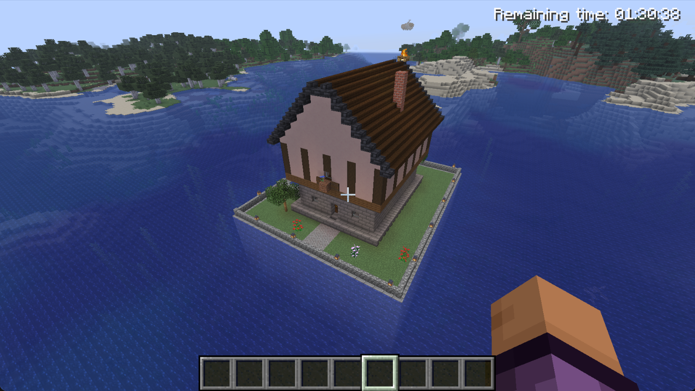
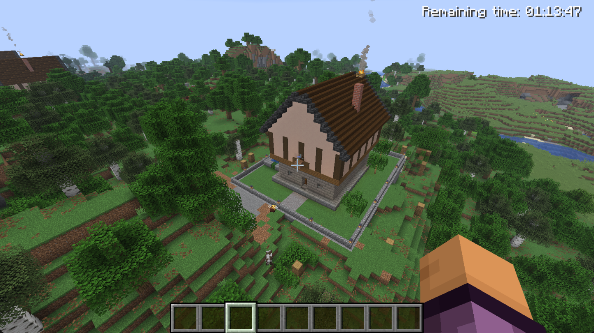
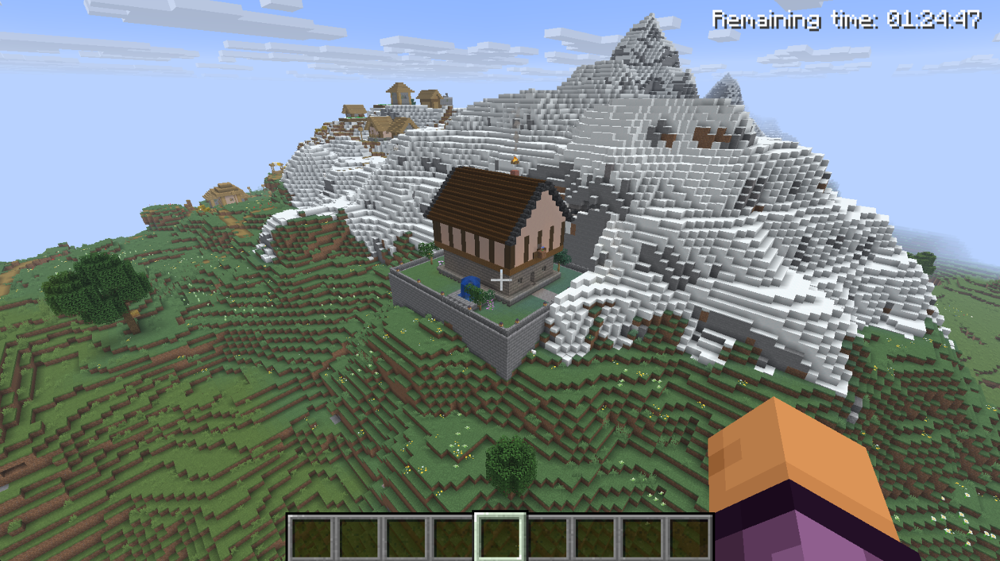
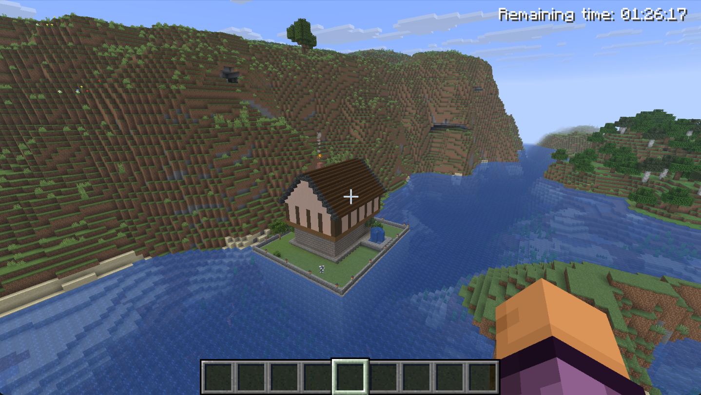
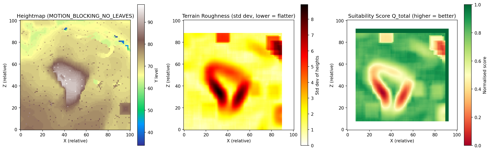

# MGAIA Assignment 1: Procedural Estate Generation

This repository contains a procedural content generation (PCG) script for Minecraft, developed for the **Modern Game AI Algorithms (MGAIA)** course at Leiden University. 

Using the[GDPC (Generative Design Python Client)](https://github.com/avdstaaij/gdpc) framework, the script evaluates in-game terrain and procedurally constructs a highly detailed, Tudor-style grand manor complete with a landscaped garden, retaining walls, and custom flora.

## Key Features (The "Mini-Report")

Instead of simply placing a house on a flat plane, this algorithm is designed for **extreme terrain adaptability** and **believability**:

*   **Terrain Suitability Analysis:** Extracts the `MOTION_BLOCKING_NO_LEAVES` heightmap and uses a sliding-window standard deviation algorithm (`numpy` & `scipy`) to score and locate the optimal, flattest $26 \times 26$ building site.
*   **Estate Terraforming:** The algorithm dynamically builds a level terrace. If spawned in an ocean, it constructs an artificial island with watertight retaining walls extending to the ocean floor. If spawned on a mountain, it carves out a level plateau.
*   **Perimeter Scrubbing:** Defines a 7-block buffer zone outside the estate walls that automatically deletes overhanging trees, leaves, and terrain to ensure the property remains clean and unobstructed.
*   **Architectural Variation:** Randomizes core building dimensions (7-11 blocks wide/deep) and selects from multiple material palettes (Nordic, Stone Fortress, Oak Cottage, Birch). Features an overhanging timber-frame second story, steep A-frame roofing, and a smoking chimney.
*   **Dynamic Landscaping:** Generates an enclosed cobblestone perimeter, a paved pathway, custom-built trees, and a functional water fountain.

## Prerequisites

To run this code, you need:
1. **Minecraft Java Edition** installed and running.
2. The **Fabric Loader** and the **GGDMC HTTP interface mod** (v1.8.1) installed in your `mods` folder.
3. **Python 3.x** with the following packages installed:
   ```bash
   pip install gdpc numpy scipy matplotlib
   ```

## How to Replicate the Results

1. **Launch Minecraft** using your Fabric profile and open a world.
2. **Set the Build Area:** Stand in the area where you want the estate to generate (e.g., near an ocean, forest, or mountain) and type the following command in the Minecraft chat:
   ```text
   /buildarea set ~-50 ~-20 ~-50 ~50 ~50 ~50
   ```
3. **Run the Generator:** Open your terminal in this repository's folder and execute the script:
   ```bash
   python submission.py
   ```
4. **View the Output:** The console will output the coordinates of the generated estate (e.g., `Selected estate site at X, Z`). It will also generate a `terrain_analysis.png` heatmap plot in your folder. Teleport to the estate in-game using:
   ```text
   /tp <X> <Y> <Z>
   ```

## Example Generations

The algorithm adapts seamlessly to completely different biomes and terrains. Below are four examples generated by this exact script:

### 1. Ocean Island Terraforming
*Constructs a deep retaining wall down to the ocean floor and backfills with dirt to create a level island.*


### 2. Mountain Plateau Carving
*Carves into extreme slopes and builds foundational supports on the downhill side.*


### 3. Forest Perimeter Scrubbing
*Clears a buffer zone through dense canopies to prevent leaves from clipping into the architecture.*


### 4. Coastal Hybrid
*Bridges the gap between solid land and deep water with an adaptive foundation.*


### Terrain Analysis Plot
*Automatically generated by the script to visualize the decision-making process for site selection.*

```